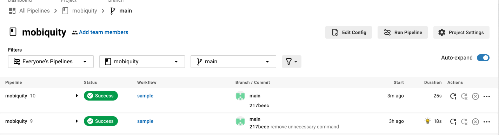

# mobiquity
API Automation

Pre-requisite Tools :
- Java 8 to 11

Framework and Tools used :
- Language : Java
- Cucumber BDD
- Maven for dependency management
- Junit

_Step Definition (Functions) for test contains in :_ `src/main/java/StepsFunctions/fetchUserDetails.java`

`End2End_Test.feature` _contains test criteria and scenarios :_ `src/test/resources/features/End2End_Test.feature`

_Runner Class path :_ src/test/java/Runner/Runner.java

To Run test Locally :

Clone repo https://github.com/anuppatil17/mobiquity.git

go inside project /mobiquity where contains pom.xml

_`Run Command :`_  mvn clean test

OR

Run Circle CI builds on `main` branch 

URL : https://app.circleci.com/pipelines/github/anuppatil17/mobiquity?branch=main

Invite Link to Access Circle CI project : https://app.circleci.com/pipelines/github/anuppatil17/mobiquity?invite=true

**Circle Ci Build info snap :** 

Build Step result Snap :

